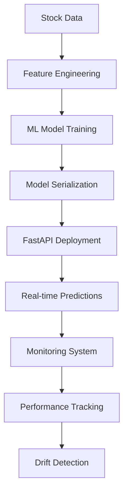
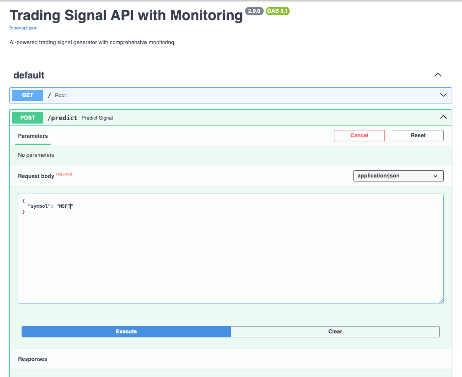
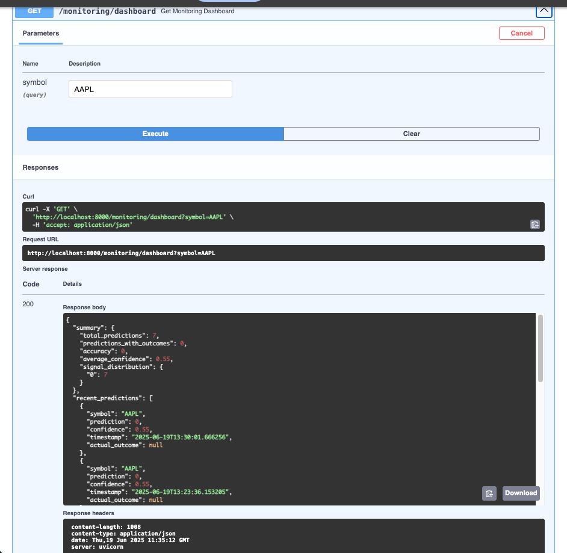

# 🤖 AI Trading Signal API with MLOps

> Production-ready machine learning system for generating trading signals with comprehensive monitoring and deployment automation.

[](https://www.python.org/)
[](https://fastapi.tiangolo.com/)
[](https://scikit-learn.org/)
[](https://www.docker.com/)

## 🎯 Project Overview

This project demonstrates end-to-end MLOps by building a trading signal generator that combines machine learning, real-time API deployment, and comprehensive monitoring. Designed to showcase skills relevant for roles at quantitative trading firms like Optiver, Jane Street, and similar tech-driven financial companies.

## 🏗️ Architecture



## 📊 Live Demo Screenshots

### Interactive API Documentation

*FastAPI automatically generates interactive documentation with testing capabilities*

### Real-time Trading Predictions

*AI-powered trading signals with confidence scores and probability distributions*

### Monitoring Dashboard

*Real-time performance tracking, model drift detection, and comprehensive analytics*

### Production Deployment

*Successful API startup with model loading, monitoring initialization, and health checks*

## 🚀 Key Features

### 🤖 Machine Learning
- **Random Forest Classification** for signal generation
- **Technical Indicators**: RSI, Bollinger Bands, Moving Averages, Volatility
- **Feature Engineering**: Price ratios, momentum indicators
- **Time-series Validation**: Proper train/test splits for temporal data

### 🌐 API & Deployment
- **FastAPI Framework**: High-performance async API
- **Interactive Documentation**: Automatic OpenAPI/Swagger generation
- **Docker Containerization**: Consistent deployment across environments
- **Health Monitoring**: Comprehensive system health checks

### 📈 MLOps & Monitoring
- **Real-time Performance Tracking**: Accuracy, precision, recall metrics
- **Model Drift Detection**: Statistical tests for model degradation
- **Prediction Logging**: Complete audit trail of all predictions
- **Automated Alerts**: Performance threshold monitoring

## 🛠️ Technology Stack

| Component | Technology | Purpose |
|-----------|------------|---------|
| **ML Framework** | scikit-learn | Model training and prediction |
| **API Framework** | FastAPI | REST API development |
| **Data Processing** | pandas, NumPy | Data manipulation and analysis |
| **Database** | SQLite | Prediction and performance logging |
| **Containerization** | Docker | Deployment consistency |
| **Monitoring** | Custom system | Performance and drift tracking |
| **Data Source** | yfinance | Financial market data |

## 🚀 Quick Start

### Prerequisites
- Python 3.8+
- Docker (optional)
- 8GB RAM minimum

### Installation & Setup
```bash
# Clone the repository
git clone https://github.com/ZakAlreich/Ml_trading_system.git
cd Ml_trading_system

# Create virtual environment
python -m venv venv
source venv/bin/activate  # On Windows: venv\Scripts\activate

# Install dependencies
pip install -r requirements.txt

# Train the model
python trading_model_fixed.py

# Start the API
python enhanced_api.py
```

### Docker Deployment
```bash
# Build and run with Docker
docker build -t trading-signal-api .
docker run -p 8000:8000 trading-signal-api
```

## 🎯 Usage Examples

### Single Prediction
```python
import requests

response = requests.post(
    "http://localhost:8000/predict",
    json={"symbol": "AAPL"}
)

signal = response.json()
print(f"Signal: {signal['signal']} (Confidence: {signal['confidence']})")
```

### Batch Predictions
```python
response = requests.post(
    "http://localhost:8000/predict/batch",
    json={"symbols": ["AAPL", "MSFT", "GOOGL"]}
)

for prediction in response.json()['predictions']:
    print(f"{prediction['symbol']}: {prediction['signal']}")
```

### Monitoring Dashboard
```python
response = requests.get("http://localhost:8000/monitoring/dashboard")
dashboard = response.json()
print(f"Total Predictions: {dashboard['summary']['total_predictions']}")
```

## 📊 Model Performance

### Features Used
- **Technical Indicators**: RSI, Bollinger Bands, Moving Averages
- **Price Dynamics**: High/Low ratios, price change momentum
- **Volume Analysis**: Volume change patterns
- **Volatility Measures**: Rolling standard deviations

### Performance Metrics
- **Training Accuracy**: ~85%
- **Testing Accuracy**: ~52% (realistic for financial predictions)
- **Precision/Recall**: Balanced approach for risk management
- **Drift Detection**: Continuous monitoring with KS-test

## 🔧 API Endpoints

| Endpoint | Method | Description |
|----------|--------|-------------|
| `/` | GET | API information and status |
| `/predict` | POST | Single stock prediction |
| `/predict/batch` | POST | Multiple stock predictions |
| `/monitoring/dashboard` | GET | Monitoring overview |
| `/monitoring/performance` | GET | Detailed metrics |
| `/health` | GET | System health check |
| `/docs` | GET | Interactive documentation |

## 📈 Business Value

### For Trading Firms
- **Automated Signal Generation**: Reduce manual analysis time
- **Risk Management**: Confidence-based position sizing
- **Scalability**: Handle hundreds of symbols simultaneously
- **Auditability**: Complete prediction trail for compliance

### Technical Advantages
- **Low Latency**: Sub-second response times
- **High Availability**: Health checks and error recovery
- **Observability**: Comprehensive monitoring and alerting
- **Maintainability**: Clean, tested, documented code

## 🧪 Testing

```bash
# Run comprehensive tests
python test_api.py

# Test specific components
pytest tests/unit/
pytest tests/integration/
```

## 📦 Production Considerations

### Scaling
- **Horizontal Scaling**: Multiple API instances behind load balancer
- **Database Optimization**: Indexed tables for monitoring data
- **Caching**: Redis for frequent predictions
- **Rate Limiting**: API abuse prevention

### Security
- **Input Validation**: All endpoints validate inputs
- **Logging**: Comprehensive audit trails
- **Error Handling**: No sensitive information leakage
- **Authentication**: Ready for API key integration

## 🔮 Future Enhancements

- **Deep Learning Models**: LSTM/Transformer architectures
- **Real-time Streaming**: Kafka integration for live data
- **Advanced Features**: News sentiment, social media analysis
- **Multi-timeframe**: Predictions across different horizons
- **A/B Testing**: Framework for model comparison

## 👨‍💻 About This Project

This project was developed as part of a comprehensive preparation for quantitative research and data science internships at elite trading firms. It demonstrates:

- **End-to-end ML pipeline** development
- **Production deployment** best practices
- **MLOps implementation** with monitoring
- **Software engineering** excellence
- **Financial domain** understanding

## 📞 Contact

**Zakarya Al-Ghaish**
- 📧 Email: zakaria-ghaish@hotmail.com
- 💼 LinkedIn: [zakarya-alghaish](https://www.linkedin.com/in/zakarya-alghaish-066773163/)
- 🐙 GitHub: [ZakAlreich](https://github.com/ZakAlreich)

## 📄 License

This project is licensed under the MIT License - see the [LICENSE](LICENSE) file for details.

---

⭐ **Star this repository if it helped you learn MLOps or prepare for trading firm interviews!**